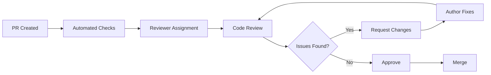

# Code Review Guidelines

**Last Updated:** 2025-01-13  
**Version:** 1.0.0

This document provides comprehensive guidelines for conducting effective code reviews in the MarkItDown GUI project.

## Table of Contents

1. [Review Philosophy](#review-philosophy)
2. [Review Process](#review-process)
3. [Review Checklist](#review-checklist)
4. [Code Quality Standards](#code-quality-standards)
5. [Security Considerations](#security-considerations)
6. [Performance Guidelines](#performance-guidelines)
7. [Communication Guidelines](#communication-guidelines)
8. [Common Issues](#common-issues)

## Review Philosophy

### Core Principles
- **Constructive**: Focus on improving code quality and knowledge sharing
- **Respectful**: Maintain professionalism and empathy
- **Educational**: Use reviews as learning opportunities
- **Consistent**: Apply standards uniformly across all code
- **Timely**: Provide feedback within 24-48 hours

### Review Goals
- Ensure code correctness and functionality
- Maintain consistency with project standards
- Identify potential security vulnerabilities
- Optimize performance and resource usage
- Share knowledge and best practices
- Prevent technical debt accumulation

## Review Process

### 1. Pre-Review Checklist (Author)
Before requesting review, ensure:

```bash
# Run all tests
python -m pytest tests/ -v --cov=src

# Check code formatting
black --check src/ tests/
isort --check-only src/ tests/

# Run linting
flake8 src/ tests/
pylint src/

# Type checking
mypy src/

# Security scan
bandit -r src/
```

### 2. Review Assignment
- **Small Changes** (<100 lines): 1 reviewer minimum
- **Medium Changes** (100-500 lines): 2 reviewers recommended
- **Large Changes** (>500 lines): 2+ reviewers required
- **Critical Changes**: Security team + domain expert review

### 3. Review Timeline
- **Initial Review**: Within 24 hours of assignment
- **Follow-up Reviews**: Within 8 hours of updates
- **Final Approval**: Within 4 hours of resolution

### 4. Review Workflow


## Review Checklist

### Functionality Review
```yaml
Core Functionality:
  - [ ] Code does what it's supposed to do
  - [ ] Edge cases are handled appropriately
  - [ ] Error conditions are handled gracefully
  - [ ] Input validation is comprehensive
  - [ ] Output is correct and complete

Business Logic:
  - [ ] Implements requirements correctly
  - [ ] Follows established patterns
  - [ ] Maintains data integrity
  - [ ] Handles concurrent operations safely
  - [ ] Integrates properly with existing systems
```

### Code Quality Review
```yaml
Structure & Design:
  - [ ] Functions are single-purpose and focused
  - [ ] Classes follow single responsibility principle
  - [ ] Appropriate use of design patterns
  - [ ] Proper separation of concerns
  - [ ] No unnecessary complexity

Readability:
  - [ ] Code is self-documenting
  - [ ] Variable names are meaningful
  - [ ] Functions have clear purposes
  - [ ] Comments explain 'why', not 'what'
  - [ ] Consistent formatting and style

Maintainability:
  - [ ] Code follows DRY principle
  - [ ] No hard-coded values
  - [ ] Configuration is externalized
  - [ ] Dependencies are minimal and justified
  - [ ] Code is testable
```

### Technical Review
```yaml
Performance:
  - [ ] Algorithms are efficient
  - [ ] No unnecessary database queries
  - [ ] Memory usage is reasonable
  - [ ] No performance regressions
  - [ ] Caching used appropriately

Security:
  - [ ] Input sanitization implemented
  - [ ] No SQL injection vulnerabilities
  - [ ] Authentication/authorization correct
  - [ ] Sensitive data handled properly
  - [ ] No secrets in code

Error Handling:
  - [ ] Exceptions are caught appropriately
  - [ ] Error messages are helpful
  - [ ] Graceful degradation implemented
  - [ ] Logging is comprehensive
  - [ ] Recovery mechanisms in place
```

### Testing Review
```yaml
Test Coverage:
  - [ ] Unit tests for new functionality
  - [ ] Integration tests for interactions
  - [ ] Edge cases are tested
  - [ ] Error conditions are tested
  - [ ] Performance tests for critical paths

Test Quality:
  - [ ] Tests are independent
  - [ ] Tests are deterministic
  - [ ] Test names are descriptive
  - [ ] Tests use appropriate assertions
  - [ ] Mock objects used properly
```

## Code Quality Standards

### Python Code Standards
```python
# Good: Clear, descriptive function with proper types
def convert_document_to_format(
    input_path: Path, 
    output_format: ConversionFormat,
    options: ConversionOptions = None
) -> ConversionResult:
    """Convert document to specified format with validation.
    
    Args:
        input_path: Path to input document file
        output_format: Target conversion format
        options: Optional conversion parameters
    
    Returns:
        Result object with status and output information
    
    Raises:
        FileNotFoundError: If input file doesn't exist
        UnsupportedFormatError: If format not supported
    """
    if not input_path.exists():
        raise FileNotFoundError(f"Input file not found: {input_path}")
    
    try:
        converter = ConverterFactory.create(output_format)
        result = converter.convert(input_path, options or ConversionOptions())
        
        logger.info(
            "Document converted successfully",
            extra={
                "input_path": str(input_path),
                "output_format": output_format.value,
                "file_size": input_path.stat().st_size
            }
        )
        
        return result
    except Exception as e:
        logger.error(
            "Document conversion failed",
            extra={"input_path": str(input_path), "error": str(e)},
            exc_info=True
        )
        raise ConversionError(f"Failed to convert {input_path.name}") from e

# Bad: Unclear function with poor error handling
def convert(file, fmt):
    f = open(file)
    data = f.read()
    if fmt == "pdf":
        return make_pdf(data)
    return data
```

### UI Code Standards
```python
# Good: Well-structured PyQt6 component
class DocumentConverterWidget(QWidget):
    """Widget for document conversion with progress tracking."""
    
    conversion_started = pyqtSignal(str)  # file path
    conversion_finished = pyqtSignal(ConversionResult)
    conversion_error = pyqtSignal(str)  # error message
    
    def __init__(self, parent: Optional[QWidget] = None):
        super().__init__(parent)
        self._converter: Optional[DocumentConverter] = None
        self._setup_ui()
        self._connect_signals()
    
    def _setup_ui(self) -> None:
        """Initialize user interface components."""
        layout = QVBoxLayout(self)
        
        # File selection
        file_group = self._create_file_selection_group()
        layout.addWidget(file_group)
        
        # Format selection
        format_group = self._create_format_selection_group()
        layout.addWidget(format_group)
        
        # Progress tracking
        self.progress_bar = QProgressBar()
        layout.addWidget(self.progress_bar)
        
        # Control buttons
        button_layout = self._create_button_layout()
        layout.addLayout(button_layout)
    
    def _create_file_selection_group(self) -> QGroupBox:
        """Create file selection UI group."""
        group = QGroupBox("Input File")
        layout = QHBoxLayout(group)
        
        self.file_path_edit = QLineEdit()
        self.file_path_edit.setPlaceholderText("Select file to convert...")
        layout.addWidget(self.file_path_edit)
        
        browse_button = QPushButton("Browse...")
        browse_button.clicked.connect(self._browse_file)
        layout.addWidget(browse_button)
        
        return group
```

### Database Code Standards
```python
# Good: Proper database handling with context manager
class ConversionHistoryRepository:
    """Repository for conversion history data."""
    
    def __init__(self, db_path: Path):
        self.db_path = db_path
    
    def save_conversion_record(self, record: ConversionRecord) -> int:
        """Save conversion record to database.
        
        Args:
            record: Conversion record to save
            
        Returns:
            Database ID of saved record
            
        Raises:
            DatabaseError: If save operation fails
        """
        with self._get_connection() as conn:
            try:
                cursor = conn.cursor()
                cursor.execute(
                    """
                    INSERT INTO conversion_history 
                    (input_file, output_file, format, timestamp, duration, status)
                    VALUES (?, ?, ?, ?, ?, ?)
                    """,
                    (
                        str(record.input_file),
                        str(record.output_file),
                        record.format.value,
                        record.timestamp.isoformat(),
                        record.duration,
                        record.status.value
                    )
                )
                conn.commit()
                return cursor.lastrowid
            except sqlite3.Error as e:
                conn.rollback()
                raise DatabaseError(f"Failed to save conversion record: {e}") from e
    
    @contextmanager
    def _get_connection(self):
        """Get database connection with proper cleanup."""
        conn = None
        try:
            conn = sqlite3.connect(self.db_path)
            conn.execute("PRAGMA foreign_keys = ON")
            yield conn
        finally:
            if conn:
                conn.close()
```

## Security Considerations

### Input Validation
```python
# Good: Comprehensive input validation
def validate_file_upload(file_path: Path, max_size: int = 100_000_000) -> None:
    """Validate uploaded file for security and constraints.
    
    Args:
        file_path: Path to uploaded file
        max_size: Maximum allowed file size in bytes
        
    Raises:
        ValidationError: If file fails validation
    """
    # Check file existence
    if not file_path.exists():
        raise ValidationError("File does not exist")
    
    # Check file size
    file_size = file_path.stat().st_size
    if file_size > max_size:
        raise ValidationError(f"File too large: {file_size} bytes (max: {max_size})")
    
    # Check file extension
    allowed_extensions = {'.pdf', '.docx', '.txt', '.md', '.html'}
    if file_path.suffix.lower() not in allowed_extensions:
        raise ValidationError(f"Unsupported file type: {file_path.suffix}")
    
    # Check for malicious content (basic)
    try:
        with open(file_path, 'rb') as f:
            header = f.read(1024)
            if b'<script' in header.lower() or b'javascript:' in header.lower():
                raise ValidationError("Potentially malicious content detected")
    except IOError as e:
        raise ValidationError(f"Could not read file: {e}")

# Bad: No validation
def process_file(filename):
    with open(filename) as f:
        return f.read()
```

### Authentication & Authorization
```python
# Good: Proper permission checking
@require_permission('file.convert')
def convert_document_endpoint(request: Request) -> Response:
    """Convert document endpoint with proper authorization."""
    # Validate user has permission
    if not request.user.has_permission('file.convert'):
        raise PermissionDeniedError("Insufficient permissions")
    
    # Validate request data
    file_data = validate_conversion_request(request.json)
    
    # Check file ownership or access rights
    if not can_access_file(request.user, file_data['file_path']):
        raise AccessDeniedError("File access denied")
    
    # Proceed with conversion
    result = conversion_service.convert(file_data)
    
    # Log access for audit
    audit_logger.info(
        "Document conversion requested",
        extra={
            "user_id": request.user.id,
            "file_path": file_data['file_path'],
            "output_format": file_data['format']
        }
    )
    
    return Response(result.to_dict())
```

## Performance Guidelines

### Efficient Algorithms
```python
# Good: Efficient file processing with streaming
def process_large_file(file_path: Path, chunk_size: int = 8192) -> Iterator[ProcessedChunk]:
    """Process large file in chunks to manage memory usage.
    
    Args:
        file_path: Path to file to process
        chunk_size: Size of chunks to process at a time
        
    Yields:
        Processed file chunks
    """
    with open(file_path, 'rb') as file:
        while chunk := file.read(chunk_size):
            processed_chunk = apply_transformations(chunk)
            yield ProcessedChunk(
                data=processed_chunk,
                position=file.tell() - len(chunk),
                size=len(chunk)
            )

# Bad: Memory-intensive approach
def process_large_file_bad(file_path):
    with open(file_path, 'rb') as f:
        all_data = f.read()  # Could consume gigabytes of memory
    return process_all_data(all_data)
```

### Database Performance
```python
# Good: Efficient database operations
def get_conversion_history_batch(
    user_id: int, 
    offset: int = 0, 
    limit: int = 50
) -> List[ConversionRecord]:
    """Get conversion history with pagination and proper indexing."""
    with self._get_connection() as conn:
        cursor = conn.cursor()
        cursor.execute(
            """
            SELECT id, input_file, output_file, format, timestamp, duration
            FROM conversion_history 
            WHERE user_id = ?
            ORDER BY timestamp DESC
            LIMIT ? OFFSET ?
            """,
            (user_id, limit, offset)
        )
        
        return [
            ConversionRecord.from_row(row)
            for row in cursor.fetchall()
        ]

# Bad: Inefficient query without pagination
def get_all_conversions(user_id):
    cursor.execute("SELECT * FROM conversion_history WHERE user_id = ?", (user_id,))
    return cursor.fetchall()  # Could return millions of records
```

## Communication Guidelines

### Providing Feedback

#### Constructive Comments
```markdown
# Good Examples:

## Code Structure
"Consider extracting this logic into a separate method to improve readability and testability. The current function handles both validation and processing, which violates the single responsibility principle."

## Performance
"This loop could be optimized using a dictionary lookup instead of linear search. With the current approach, time complexity is O(n²), but using a dict would make it O(n)."

## Security
"This input should be sanitized before use. Consider using the `escape_html()` function to prevent XSS vulnerabilities."

# Bad Examples:
"This code is bad."
"Wrong approach."
"Fix this."
```

#### Asking Questions
```markdown
# Good Questions:
"Could you help me understand why this approach was chosen over using the existing utility function?"

"Is there a specific reason for not using the standard error handling pattern here?"

"Would it make sense to add a unit test for this edge case?"

# Bad Questions:
"Why did you do this?"
"What were you thinking?"
```

#### Suggesting Improvements
```markdown
# Good Suggestions:
"Consider using a context manager here to ensure proper resource cleanup:
```python
with resource_manager.get_resource() as resource:
    # use resource
```

"You might want to use the `@lru_cache` decorator to improve performance for this frequently called function."

# Bad Suggestions:
"Rewrite this completely."
"Use a different approach."
```

### Responding to Feedback

#### Accepting Feedback
```markdown
# Good Responses:
"Thanks for catching that! I'll add the input validation."

"Great suggestion about using a context manager. I'll refactor that section."

"You're right about the performance issue. I'll implement the dictionary approach."

# Bad Responses:
"It works fine as is."
"That's not important."
"I don't have time to change it."
```

#### Asking for Clarification
```markdown
# Good Clarifications:
"Could you provide more details about the security concern you mentioned?"

"I'm not sure I understand the suggested refactoring. Could you elaborate?"

"Which specific test cases should I add for this functionality?"

# Bad Clarifications:
"What do you mean?"
"I don't understand."
```

## Common Issues

### Code Smells to Watch For

#### Complexity Issues
```python
# Red Flag: Long function with too many responsibilities
def process_document_and_send_notification_and_log_and_update_database(file_path):
    # 150+ lines of code doing multiple things
    pass

# Better: Single responsibility functions
def process_document(file_path: Path) -> ProcessingResult:
    """Process document and return result."""
    pass

def send_notification(result: ProcessingResult) -> None:
    """Send notification about processing result."""
    pass

def log_processing_result(result: ProcessingResult) -> None:
    """Log processing result for audit."""
    pass
```

#### Error Handling Issues
```python
# Red Flag: Catching all exceptions silently
try:
    risky_operation()
except:
    pass  # Silent failure

# Better: Specific exception handling with logging
try:
    risky_operation()
except SpecificError as e:
    logger.error(f"Operation failed: {e}")
    raise ProcessingError("Could not complete operation") from e
except Exception as e:
    logger.exception("Unexpected error in risky_operation")
    raise
```

#### Performance Issues
```python
# Red Flag: N+1 query problem
def get_users_with_posts():
    users = User.objects.all()
    for user in users:
        posts = Post.objects.filter(user_id=user.id)  # N queries
        user.posts = posts
    return users

# Better: Single query with join
def get_users_with_posts():
    return User.objects.prefetch_related('posts').all()
```

### Testing Issues

#### Insufficient Test Coverage
```python
# Red Flag: Only testing happy path
def test_convert_document():
    result = convert_document("test.txt", "pdf")
    assert result.success

# Better: Comprehensive testing
def test_convert_document_success():
    result = convert_document("test.txt", "pdf")
    assert result.success
    assert result.output_path.exists()

def test_convert_document_file_not_found():
    with pytest.raises(FileNotFoundError):
        convert_document("missing.txt", "pdf")

def test_convert_document_unsupported_format():
    with pytest.raises(UnsupportedFormatError):
        convert_document("test.txt", "xyz")

def test_convert_document_empty_file():
    result = convert_document("empty.txt", "pdf")
    assert not result.success
    assert "empty file" in result.error_message.lower()
```

#### Flaky Tests
```python
# Red Flag: Time-dependent test
def test_processing_time():
    start = time.time()
    process_document("test.txt")
    duration = time.time() - start
    assert duration < 1.0  # Flaky - depends on system load

# Better: Test behavior, not timing
def test_processing_completes():
    result = process_document("test.txt")
    assert result.success
    assert result.output_path.exists()

@pytest.mark.performance
def test_processing_performance():
    """Performance test - run separately from functional tests."""
    with timer() as t:
        process_document("large_test.txt")
    assert t.elapsed < 5.0  # Run in controlled environment
```

## Review Tools and Automation

### Static Analysis Integration
```yaml
# GitHub Actions for automated review checks
name: Code Review Checks
on: [pull_request]

jobs:
  static-analysis:
    runs-on: ubuntu-latest
    steps:
      - uses: actions/checkout@v3
      
      - name: Set up Python
        uses: actions/setup-python@v3
        with:
          python-version: 3.11
      
      - name: Install dependencies
        run: |
          pip install flake8 pylint mypy bandit black isort
      
      - name: Code formatting check
        run: |
          black --check src/ tests/
          isort --check-only src/ tests/
      
      - name: Linting
        run: |
          flake8 src/ tests/
          pylint src/
      
      - name: Type checking
        run: mypy src/
      
      - name: Security scan
        run: bandit -r src/ -f json -o security-report.json
      
      - name: Upload security report
        uses: actions/upload-artifact@v3
        with:
          name: security-report
          path: security-report.json
```

### Code Review Metrics
Track and improve review effectiveness:

```python
# Example metrics to track
review_metrics = {
    "average_review_time": "24 hours",
    "defect_escape_rate": "<2%",
    "code_coverage_maintained": ">90%",
    "reviewer_participation": ">80%",
    "pr_size_distribution": {
        "small": "70%",
        "medium": "25%", 
        "large": "5%"
    }
}
```

---

For questions about code reviews, please:
- Check the [Development Workflow](workflow.md)
- Review the [Release Process](release-process.md)
- Consult the project style guides
- Reach out to senior team members for guidance